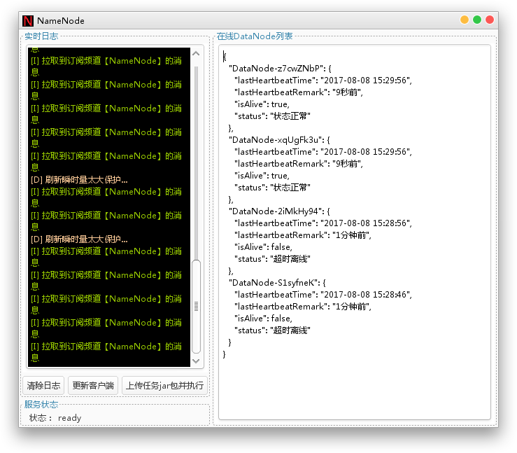

# SimpleDistributedPlatform
A very simple distributed computing platform, based on mq and naming service

Email:  lnwazg@126.com  
QQ：  914096874      
QQ Group: 304153330  


## 一:平台效果：

1. NameNode    
基于Swing开发的任务调度系统  


2. DataNode  
基于Swing开发的任务执行器  


3. 辅助工具MyZooKeeper  
基于Swing实现的Naming Service 服务注册与发现管理器  


4. MQ  
基于Swing实现的轻量级MQ（仅提供点对点模式）  


## 二：运行方法
在NameNode端选择待执行的分布式任务jar包，点击上传jar包  

弹出jar包上传成功，点击确认键，开始执行分布式任务  

任务执行过程在左侧的日志中展示：  


当所有的节点计算完毕之后，NameNode会将结果汇总展示在日志中  

## 三：分布式任务代码jar包的编写
每个Task任务都需要继承自DistributedTask类，实现指定的方法：  

```
package com.lnwazg;

import java.util.List;
import java.util.Map;

import com.lnwazg.api.DistributedTask;
import com.lnwazg.bean.HandleResult;

/**
 * 第0个节点从1计数到10000，第1个节点从10001计数到20000，以此类推，最终上送总和数据
 * @author nan.li
 * @version 2017年7月14日
 */
public class Task002 extends DistributedTask
{
    @Override
    public void executeCustom(Map<String, Object> map)
    {
        //汇总计算结果
        int sum = 0;
        int start = nodeNum * 10000 + 1;//1        10001
        int end = (nodeNum + 1) * 10000;//10000     20000
        for (int i = start; i <= end; i++)
        {
            sum += i;
        }
        //上报计算结果
        report("sum", sum);
    }
    
    public String getTaskDescription()
    {
        return "第一个节点从1计数到10000，第二个节点从10001计数到20000，以此类推，最终上送总和数据";
    }
    
    @Override
    public HandleResult reducer(Map<String, List<HandleResult>> handleResultsMap)
    {
        int sum = 0;
        for (String nodeNum : handleResultsMap.keySet())
        {
            List<HandleResult> handleResults = handleResultsMap.get(nodeNum);
            //因为只有1步上送，因此只要取出第1步的上送结果即可！
            sum += Integer.valueOf(handleResults.get(0).getParamMap().get("sum"));
        }
        return new HandleResult().setResult(sum);
    }
}

```

父类探析：   

```
package com.lnwazg.api;

import java.util.List;
import java.util.Map;

import com.lnwazg.bean.HandleResult;
import com.lnwazg.swing.util.WinMgr;
import com.lnwazg.ui.MainFrame;

/**
 * 分布式任务，抽象类，便于具体任务去实现
 * @author nan.li
 * @version 2017年7月6日
 */
public abstract class DistributedTask
{
    /**
     * 当前的节点号
     */
    protected int nodeNum = 0;
    
    /**
     * 当前节点的请求序号
     */
    protected int nodeNumReqNum = 0;
    
    /**
     * DataNode的统一执行调用入口，核心的执行方法
     * @author nan.li
     * @param map
     */
    public void execute(Map<String, Object> map)
    {
        //获取当前的节点号
        nodeNum = Integer.valueOf(map.get("nodeNum").toString());
        
        //定制的执行内容
        executeCustom(map);
        
        //计算结束
        end();
    }
    
    /**
     * 待客户端实现的自定义方法
     * @author nan.li
     */
    public abstract void executeCustom(Map<String, Object> map);
    
    /**
     * mapper，服务端的映射处理，存储请求参数
     * @author nan.li
     * @param paramMap  参数表，通过mq所发送出去的参数
     * @return  处理结果对象
     */
    public HandleResult mapper(Map<String, String> paramMap)
    {
        //节点号
        String nodeNum = paramMap.get("nodeNum");
        
        //节点的请求序号
        String nodeNumReqNum = paramMap.get("nodeNumReqNum");
        
        //单步的处理结果
        return new HandleResult().setNodeNum(nodeNum).setNodeNumReqNum(nodeNumReqNum).setParamMap(paramMap);
    }
    
    /**
     * reducer，服务端的汇总处理
     * @author nan.li
     * @param handleResultsMap  参数表，每一步处理数据的结果集
     * @return  最终的汇总结果对象
     */
    public HandleResult reducer(Map<String, List<HandleResult>> handleResultsMap)
    {
        return null;
    }
    
    /**
     * 获取任务的描述信息
     * @author nan.li
     * @return
     */
    public abstract String getTaskDescription();
    
    /**
     * 获取当前的客户端名称
     * @author nan.li
     * @return
     */
    public String getCurrentDataNodeName()
    {
        return WinMgr.win(MainFrame.class).myselfAddress;
    }
    
    /**
     * 计算过程的数据上报<br>
     * 会自定上报当前的节点号
     * @author nan.li
     * @param key
     * @param value
     */
    public void report(Object... keyvalues)
    {
        Object[] paramsSend = new Object[keyvalues.length + 2 + 2];
        int i = 0;
        for (; i < keyvalues.length; i++)
        {
            paramsSend[i] = keyvalues[i];
        }
        // "nodeNum", nodeNum++
        //节点号
        paramsSend[i] = "nodeNum";
        paramsSend[i + 1] = nodeNum;
        
        //该节点的请求序号
        paramsSend[i + 2] = "nodeNumReqNum";
        paramsSend[i + 3] = nodeNumReqNum++;
        
        WinMgr.win(MainFrame.class).report(paramsSend);
    }
    
    /**
     * 任务执行完毕了
     * @author nan.li
     */
    public void end()
    {
        WinMgr.win(MainFrame.class).endTask();
    }
}

```


## 四：原理解析  

NameNode和DataNode这两个名字是直接引用的hadoop里面的概念，但是更加简化：  

NameNode：用于分发可执行jar包，收集中间计算结果，合并汇总最终计算结果  

DataNode：用于接收可执行jar包，执行指定的任务方法，上报计算（中间）结果  

MyZooKeeper：用于注册与查找MQ服务。  

NameNode和DataNode通过MQ进行异步通信。  

运行原理：  

DataNode上线时，向MQ发送一条DataNode上线的消息，NameNode监听该消息，并在NameNode本地维护一个List<DataNode>的列表。 当NameNode下发可执行jar包时，NameNode依次向本地的List<DataNode>每条记录发送一条可执行任务的消息，消息内包含jar包的url地址。每个DataNode收到消息后执行可执行jar包的指定方法，并上报中间数据。 当每个DataNode执行完毕后，要执行一个end()方法，代表该DataNode已经执行完毕了。当Namenode收到了所有的DataNode的自己执行完毕的消息后，开始对所有的中间结果计算合并，最终算出汇总的值。


## 五：release运行方法
1. 本地配置host ：127.0.0.1    myzoo.lnwazg.com
2. 启动MY_ZOO_SERVER-1.1.jar  服务注册与发现服务器  
3. 启动MQ_SERVER-1.1.jar      MQ服务器
4. 启动NameNode-1.1.jar       指挥官节点
5. 启动DataNode-1.1.jar   	 工人节点，可以启动多个
6. 在NameNode-1.1.jar的界面中点击“上传任务jar包并执行”提交分布式计算jar包

备注：
示例jar包在release/jartasks/目录下


## 六：版本更新
v1.1  
第一版。仅提供基本功能：下发jar包并分布式远程执行，服务端可以根据情况去汇总执行结果，也可以做监控分析。  
初版提供了一个分布式计算系统应有的基本特性，你可以基于它实现：  
a)分布式数据抓取  
b)分布式统计计算  
c)分布式业务操作  
d)分布式分解计算巨量的计算任务  

具体一点的应用场景，举几个例子如下：     
a) 分布式图片抓取、分布式文本抓取  
b) 分布式计算π的值  
c) 控制集群里的机器对电商网站进行分布式秒杀活动商品        
d) 分解分析计算外星信号、生物工程领域分解计算生物分子结构  
e) 组织10w台机器发起一场DDOS攻击...    

总之具体要实现什么功能完全取决于你的需要，以及...想象力！  

v1.2  
这个版本主要是重要的功能完善以及bug fix。  
新增客户端状态心跳检测、 从服务端一键更新所有在线的客户端两大功能！  

a) 心跳检测：可以实时掌握各个客户端的存活状态：状态正常 or 超时离线。  
b) 一键更新客户端：当需要批量更新内网的客户端的时候，只要在服务端一键下发客户端的最新的jar包，即可自动更新所有在线的客户端。每个客户端更新完毕后，会自动重启生效！
